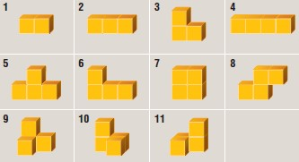

# Blokus3D Solver

This is my first C# application, created to practice for a job interview back in 2012.

## Setup

The goal of the application is to completely fill a 3 dimensional space with a (sub)set of the pieces of the Block3D game. Any of the 3 dimensions of the space to solve is configurable with a minimum of 1 and a maximum of 6. The unique pieces are shown in the image below. There are 4 sets of pieces, allowing the solver to use the same piece 4 times.

## User Interface

The graphical user interface is build using WPF. The solver can be started, paused and stopped using the first three buttons on the top and the user can rotate the 3D object by dragging the mouse. To be able to follow the algorithm's steps it is possible to reduce the solver's speed, or you can set the speed to maximum. The solutions found by the solver can be viewed piece by piece using the buttons on the bottom of the window. 

In the options window the user can change the dimensions and the pieces available to the solver.

## Implementation

The solver tries to place the available pieces in the space in an ordered manner. It uses intelligent pruning by checking if an isolated space is present. Piece objects are cached in a container by piece type, piece permutation and starting coordinate to speed up the algorithm.

## Sources

1. https://www.ultraboardgames.com/blokus/blokus-3d.php
